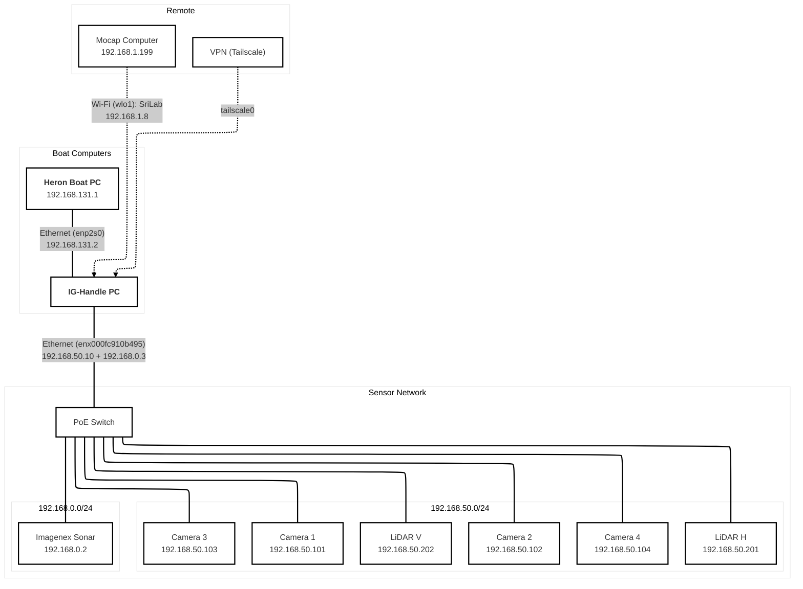
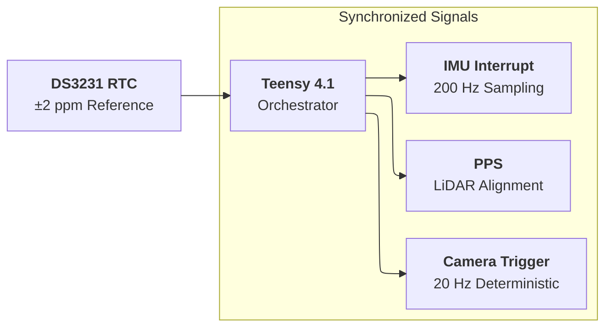

# IG Handle

IG Handle is the synchronized sensing and data-collection layer for the SLAM
GRANDE platform.

Its job is straightforward: collect the raw sensor data the rest of the stack
depends on, and make the timestamps trustworthy enough that perception and SLAM
can use the data without guesswork.

## Typical Sensor Stack

- horizontal and vertical Velodyne VLP-16 LiDARs
- four Forge IP67 GigE cameras on supported platforms
- IMU / AHRS
- Imagenex DT100 multibeam sonar
- optional motion-capture link

The exact hardware can vary by platform, but the package is organized around the
same core idea: synchronized acquisition on a dedicated onboard computer.

## Current Integration Notes

- The minimal SLAM sensor contract is horizontal LiDAR
  `/sensors/lidar/hori/points` plus Xsens IMU `/sensors/imu/data`.
- `robot:=heron` is the primary boat adapter and starts the shared IG sensor
  suite: four Forge IP67 cameras, horizontal and vertical LiDAR, IMU, and sonar.
- `robot:=handle` is a sensor-only adapter. It uses the same maintained sensor
  suite wiring but does not start an autonomous robot base.
- `robot:=husky` is an optional portability adapter. In this workspace it uses
  the same maintained sensor suite wiring and does not start Husky base drivers;
  sonar defaults off because the current Husky sensor assumption excludes sonar.
- `use_cameras:=false` disables all configured platform cameras. The older
  `use_cameras_f1f2` and `use_cameras_f3f4` args remain as compatibility aliases
  for scripts that need per-pair control.
- The stable udev aliases in `config/99-ig_handle_udev.rules` exist, but some
  launch defaults still use `/dev/serial/by-id/...` paths. If a device serial
  changes, check both the udev rule and the launch argument.

---

## System Architecture

IG Handle coordinates the sensors through a hardware timing system and a
dedicated sensor network.

### Network Topology



### Hardware Timing



---

## Synchronization Architecture

Hardware synchronization is implemented around:

- **Teensy 4.1**
- **DS3231 RTC**

This provides deterministic timing for:

| Signal | Purpose |
| :--- | :--- |
| **PPS** | LiDAR time alignment |
| **Camera trigger** | deterministic frame capture |
| **IMU interrupt** | stable sampling |

**Typical rates:**

| Sensor | Rate |
| :--- | :--- |
| Cameras | 20 Hz |
| IMU | 200 Hz |
| LiDAR | device native |

---

## Network Architecture

The sensing stack uses dedicated IPv4 subnets for the different device groups.
Multiple subnets can be assigned to the same physical Ethernet interface when
needed.

| Network | Subnet | Devices |
| :--- | :--- | :--- |
| Boat LAN | 192.168.131.0/24 | Heron, handle PC |
| Sensor network | 192.168.50.0/24 | LiDAR + cameras |
| Sonar network | 192.168.0.0/24 | Imagenex sonar |
| Mocap network | 192.168.1.0/24 | motion capture |

The handle computer uses static addresses configured with Netplan + systemd-networkd.

### Host interface configuration

| Interface | Address | Purpose |
| :--- | :--- | :--- |
| **enp2s0** | 192.168.131.2 | Heron internal network |
| **enx000fc910b495** | 192.168.50.10 | LiDAR + cameras |
| **enx000fc910b495** | 192.168.0.3 | sonar |
| **wlo1** | DHCP (192.168.1.8 on SriLab Wi-Fi) | mocap Wi-Fi connection |
| **tailscale0** | VPN | remote access |

Wi-Fi connects the handle computer to the motion capture workstation (192.168.1.199).

---

## Sensor Hostnames

Sensor hostnames are defined in `/etc/hosts`.

Example:

```text
192.168.50.201 lidar_h
192.168.50.202 lidar_v

192.168.50.101 cam1
192.168.50.102 cam2
192.168.50.103 cam3
192.168.50.104 cam4

192.168.0.2 sonar
```

This allows launch files to reference sensors by name instead of IP.

---

## Recording Data

Start recording:

```bash
roslaunch ig_handle collect_raw_data.launch
```

Output:
`~/bags/YYYY_MM_DD_HH_MM_SS/raw.bag`

---

## Remote Operation

Connect to the handle computer through the sensor network:

```bash
ssh ig-handle@192.168.50.10
```

For long captures, start the recorder inside `screen` or `tmux`.

---

## Runtime Topics vs Recorded Topics

The live driver contract uses raw ROS topics. The recorder captures many camera
streams through their `/compressed` transport to keep bags manageable. Do not
confuse the two:

| Live runtime topic | Type |
| --- | --- |
| `/sensors/camera/f1/image_raw` | `sensor_msgs/Image` |
| `/sensors/camera/f2/image_raw` | `sensor_msgs/Image` |
| `/sensors/imu/data` | `sensor_msgs/Imu` |
| `/sensors/lidar/hori/points` | `sensor_msgs/PointCloud2` |
| `/sensors/lidar/hori/packets` | `velodyne_msgs/VelodyneScan` |

`collect_raw_data.launch` invokes `ig_handle/scripts/pipeline/record_bag.sh` and
records robot-specific bag topics:

| Topic                                     | Message type                   |
|-------------------------------------------|--------------------------------|
| `/sensors/camera/f1/image_raw/compressed` | `sensor_msgs/CompressedImage`  |
| `/sensors/camera/f2/image_raw/compressed` | `sensor_msgs/CompressedImage`  |
| `/sensors/camera/time`                    | `sensor_msgs/TimeReference`    |
| `/sensors/imu/data`                       | `sensor_msgs/Imu`              |
| `/sensors/imu/time`                       | `sensor_msgs/TimeReference`    |
| `/sensors/lidar/hori/packets`             | `velodyne_msgs/VelodyneScan`   |
| `/sensors/lidar/hori/points`              | `sensor_msgs/PointCloud2`      |
| `/sensors/pps/time`                       | `sensor_msgs/TimeReference`    |

### Additional topics for ig-heron and ig-husky

| Topic                                     | Message type                   |
|-------------------------------------------|--------------------------------|
| `/sensors/camera/f3/image_raw/compressed` | `sensor_msgs/CompressedImage`  |
| `/sensors/camera/f4/image_raw/compressed` | `sensor_msgs/CompressedImage`  |
| `/sensors/lidar/vert/packets`             | `velodyne_msgs/VelodyneScan`   |
| `/sensors/lidar/vert/points`              | `sensor_msgs/PointCloud2`      |

Additional sensors:
- **ig-heron** sonar driver currently publishes raw DT100 bytes on
  `/sensors/sonar/scan` as `std_msgs/UInt8MultiArray`; downstream pointcloud
  conversion is a separate contract and should be verified before consumers
  treat this as `sensor_msgs/PointCloud2`.
- **ig-husky** thermal live topic is `/sensors/thermal/image_raw`; compressed
  capture should be verified from the active image transport before assuming a
  `/compressed` bag topic exists.

To add or remove topics, edit `ig_handle/scripts/pipeline/record_bag.sh`.

## Tests

Package tests live under `tests/`. Current coverage is intentionally light and
mostly checks launch/file contracts; it does not prove sensor timing,
calibration, sonar decoding, or full raw-bag post-processing correctness.

---

## Raw data processing

**Processing script:**
`scripts/pipeline/process_raw_bag.py`

**Processing steps:**
- Restamp camera and IMU messages using hardware timestamps
- Align sonar timestamps with PPS
- Detect timing dropouts

**Example:**
```bash
python3 process_raw_bag.py --bag raw.bag
```

---

## Verify Network Configuration

```bash
ip -br addr
```

**Expected result:**
```text
enp2s0           192.168.131.2
enx000fc910b495  192.168.50.10
enx000fc910b495  192.168.0.3
wlo1             DHCP (192.168.1.8 on SriLab Wi-Fi)
```

---

## Udev

Install device rules for stable device names:

```bash
sudo cp config/99-ig_handle_udev.rules /etc/udev/rules.d/
sudo udevadm control --reload-rules
sudo udevadm trigger
```

---

## ROS 2

A ROS 2 version of the package exists on the `ros2` branch.
