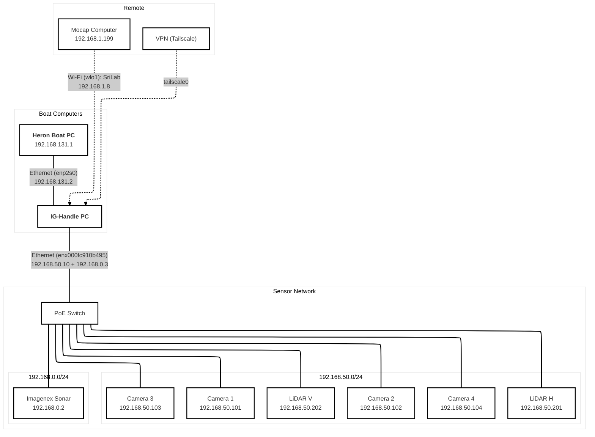
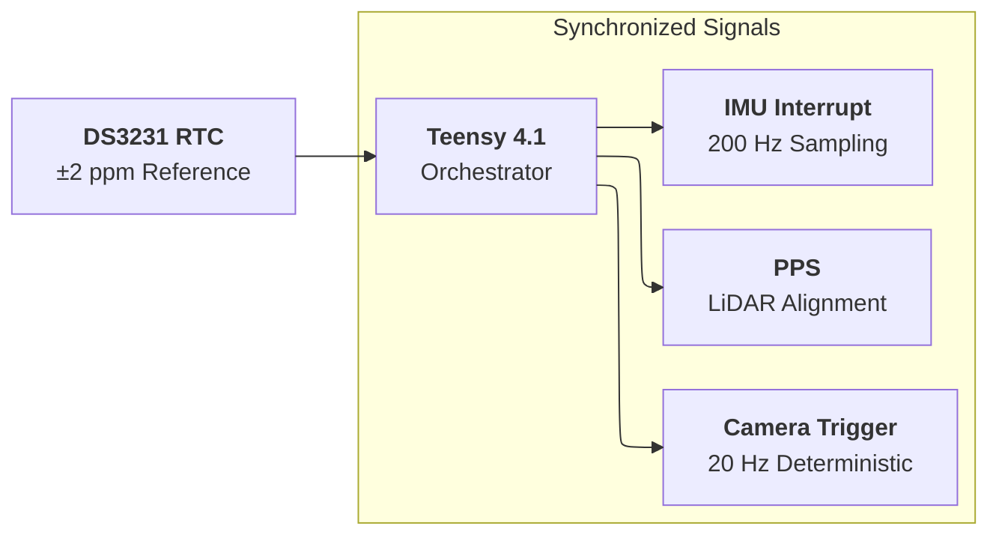

# IG Handle

IG Handle is the synchronized sensing and data-collection layer for the SLAM
GRANDE platform.

Its job is straightforward: collect the raw sensor data the rest of the stack
depends on, and make the timestamps trustworthy enough that perception and SLAM
can use the data without guesswork.

## Typical Sensor Stack

- horizontal and vertical Velodyne VLP-16 LiDARs
- four Forge IP67 GigE cameras on supported platforms
- IMU / AHRS
- Imagenex DT100 multibeam sonar
- optional motion-capture link

The exact hardware can vary by platform, but the package is organized around the
same core idea: synchronized acquisition on a dedicated onboard computer.

## Current Integration Notes

- The minimal SLAM sensor contract is horizontal LiDAR
  `/sensors/lidar/hori/points` plus Xsens IMU `/sensors/imu/data`.
- `robot:=heron` is the primary boat adapter and starts the shared IG sensor
  suite: four Forge IP67 cameras, horizontal and vertical LiDAR, IMU, and sonar.
- `robot:=handle` is a sensor-only adapter. It uses the same maintained sensor
  suite wiring but does not start an autonomous robot base.
- `robot:=husky` is an optional portability adapter. In this workspace it uses
  the same maintained sensor suite wiring as Heron and does not start Husky base
  drivers.
- `use_cameras:=false` disables all configured platform cameras.
- `use_camera_f1`, `use_camera_f2`, `use_camera_f3`, and `use_camera_f4`
  enable or disable individual Forge cameras under the global camera switch.
  The Heron adapter currently defaults to F1/F4 only because F2/F3 are
  physically disconnected until a later hardware install.
- Each Forge camera launch passes both the camera serial and expected GigE IP
  to `spinnaker_camera_driver`. This keeps ROS selection deterministic even
  when one host NIC has additional lab subnets and the Spinnaker SDK enumerates
  duplicate wrong-subnet entries for the same physical cameras.
- The default Forge ROS config uses continuous/free-run acquisition. Do not
  enable Line0 hardware trigger mode unless the trigger source is connected and
  verified; otherwise the driver can connect but publish no image buffers.
- The integrated bringup camera profile is intentionally conservative: 10 Hz,
  continuous exposure/gain with a 50 ms exposure ceiling, `BayerRG8`, ISP
  disabled, and a centered 1280x1024 ROI. Placeholder CameraInfo YAMLs for the
  four Forge serials live under `config/camera_info/`; they suppress missing
  file warnings and keep the camera-info topics present, but `K[0] = 0` marks
  them as uncalibrated. Full native 2448x2048 capture or metric vision should
  be paired with a real calibration and GigE throughput check.
- Physical layout metadata treats F1/F4 as the current center-ish cameras and
  F2/F3 as the port/left cameras. The authoritative sensor geometry lives in
  `slam_grande/config/sensors/heron_sensor_suite.yaml`; the old horizontal/
  vertical VLP-16 updater has been removed for this rig, so that transform
  should not be updated from a separate report.
- `use_teensy:=false` is the current default. The Teensy/rosserial timing path is
  still kept for lab hardware, but normal boat bringup does not start it.
- Motion capture is salvageable as an explicit localization source through the
  NatNet/datacollect bridge for standalone mocap logging.
- The stable udev aliases in `config/99-ig_handle_udev.rules` exist, but some
  launch defaults still use `/dev/serial/by-id/...` paths. If a device serial
  changes, check both the udev rule and the launch argument.

---

## System Architecture

IG Handle coordinates the sensors through a hardware timing system and a
dedicated sensor network.

### Network Topology



### Hardware Timing



---

## Synchronization Architecture

Hardware synchronization is implemented around:

- **Teensy 4.1**
- **DS3231 RTC**

This provides deterministic timing for:

| Signal | Purpose |
| :--- | :--- |
| **PPS** | LiDAR time alignment |
| **Camera trigger** | deterministic frame capture |
| **IMU interrupt** | stable sampling |

**Typical rates:**

| Sensor | Rate |
| :--- | :--- |
| Cameras | 20 Hz |
| IMU | 200 Hz |
| LiDAR | device native |

---

## Network Architecture

The sensing stack uses dedicated IPv4 subnets for the different device groups.
Multiple subnets can be assigned to the same physical Ethernet interface when
needed.

| Network | Subnet | Devices |
| :--- | :--- | :--- |
| Boat LAN | 192.168.131.0/24 | Heron, handle PC |
| Sensor network | 192.168.50.0/24 | LiDAR + cameras |
| Sonar network | 192.168.0.0/24 | Imagenex sonar |
| Mocap network | 192.168.1.0/24 | motion capture |

The handle computer uses static addresses configured with Netplan + systemd-networkd.

### Host interface configuration

| Interface | Address | Purpose |
| :--- | :--- | :--- |
| **enp2s0** | 192.168.131.2 | Heron internal network |
| **enx000fc910b495** | 192.168.50.10 | LiDAR + cameras |
| **enx000fc910b495** | 192.168.0.3 | sonar |
| **wlo1** | DHCP (192.168.1.8 on SriLab Wi-Fi) | mocap Wi-Fi connection |
| **tailscale0** | VPN | remote access |

Wi-Fi connects the handle computer to the motion capture workstation (192.168.1.199).

---

## Sensor Hostnames

Sensor hostnames are defined in `/etc/hosts`.

Example:

```text
192.168.50.201 lidar_h
192.168.50.202 lidar_v

192.168.50.101 cam1
192.168.50.102 cam2
192.168.50.103 cam3
192.168.50.104 cam4

192.168.0.2 sonar
```

This allows launch files to reference sensors by name instead of IP.

---

## Recording Data

Start recording:

```bash
roslaunch ig_handle collect_raw_data.launch
```

Output:
`~/bags/YYYY_MM_DD_HH_MM_SS_raw.bag`

`collect_raw_data.launch` starts the sensor adapter from `ig_handle`, but the
bag recorder itself is owned by `slam_grande`:

```bash
rosrun slam_grande record_bag.sh --profile raw ~/bags
```

---

## Remote Operation

Connect to the handle computer through the sensor network:

```bash
ssh ig-handle@192.168.50.10
```

For long captures, start the recorder inside `screen` or `tmux`.

---

## Runtime Topics vs Recorded Topics

The live driver contract uses raw ROS topics. The recorder captures many camera
streams through their `/compressed` transport to keep bags manageable. Do not
confuse the two:

| Live runtime topic | Type |
| --- | --- |
| `/sensors/camera/f1/image_raw` | `sensor_msgs/Image` |
| `/sensors/camera/f4/image_raw` | `sensor_msgs/Image` |
| `/sensors/imu/data` | `sensor_msgs/Imu` |
| `/sensors/lidar/hori/points` | `sensor_msgs/PointCloud2` |
| `/sensors/lidar/hori/packets` | `velodyne_msgs/VelodyneScan` |

ROS `image_transport` may also advertise sibling transport topics under each
camera root. This stack intentionally uses the raw root for runtime consumers
and `/compressed` for bagging or web streaming. Do not install or depend on
unused non-JPEG transport plugins for the Forge cameras.

The Teensy firmware publishes hardware-native timing names such as `/pps/time`,
`/cam/time`, and `/imu/time`; the rosserial bridge remaps those names locally to
`/sensors/pps/time`, `/sensors/camera/time`, and `/sensors/imu/time` so the full
stack does not need broad top-level remaps. This bridge is opt-in.

The mocap bridge is a standalone logging and comparison tool. It publishes raw
rigid-body poses under `/mocap`, normally
`/mocap/rigid_body_1/pose`. It has one publication contract and two input
transports:

- `transport:=natnet`: receive Motive/NatNet directly.
- `transport:=datacollect_udp`: receive `datacollect.heron.v1` UDP JSON packets
  from the Motive-side datacollect broadcaster on port `5005`.

The UDP transport republishes the same Heron pose topic, plus optional marker
and potential-object point clouds on `/mocap/heron/markers` and
`/mocap/potential_objects`, and status JSON on `/mocap/datacollect_status`.
In the current lab setup the Motive-side datacollect packets arrive from
`192.168.8.6` on local UDP port `5005`.

Mocap remains a lab testing and ground-truth comparison path. It does not feed
`/state/odometry` and should not be a field dependency. The datacollect UDP
receiver also leaves TF publishing off by default, so it only republishes raw
comparison/logging topics unless explicitly overridden.

Run the receiver directly when the Motive-side broadcaster is active:

```bash
roslaunch "$(rospack find ig_handle)/launch/core/natnet_bridge.launch" transport:=datacollect_udp
```

For a full DLiO-vs-mocap run, `slam_grande` can start this receiver and the
relative comparison topics from one bringup:

```bash
roslaunch slam_grande bringup.launch mode:=real use_mocap_comparison:=true bag_prefix:=mocap_dlio
rostopic pub -1 /mocap/initialize_alignment std_msgs/Bool "data: true"
```

The canonical `slam_grande` bag recorder includes these mocap topics in the raw
profile, so use the same recorder instead of maintaining a separate mocap
recording command:

```bash
rosrun slam_grande record_bag.sh --profile raw ~/bags
```

Visualize mocap against canonical odometry from `slam_grande`:

```bash
rosrun slam_grande plot_mocap_odom.py _mocap_topic:=/mocap/rigid_body_1/pose _odom_topic:=/state/odometry
```

`collect_raw_data.launch` invokes `slam_grande/scripts/utils/record_bag.sh` with
the `raw` profile. The default raw profile matches the current Heron field rig:
F1/F4 cameras, IMU, both LiDARs, DT100 sonar, base telemetry, TF, and optional
mocap comparison topics. F2/F3 and thermal camera topics are available from the
recorder with `--include-all-cameras`, but they are not part of the default
capture because F2/F3 are intentionally disconnected on the current boat.

| Topic                                     | Message type                   |
|-------------------------------------------|--------------------------------|
| `/sensors/camera/f1/image_raw/compressed` | `sensor_msgs/CompressedImage`  |
| `/sensors/camera/f4/image_raw/compressed` | `sensor_msgs/CompressedImage`  |
| `/sensors/camera/time`                    | `sensor_msgs/TimeReference`    |
| `/sensors/imu/data`                       | `sensor_msgs/Imu`              |
| `/sensors/imu/time`                       | `sensor_msgs/TimeReference`    |
| `/sensors/lidar/hori/packets`             | `velodyne_msgs/VelodyneScan`   |
| `/sensors/lidar/hori/points`              | `sensor_msgs/PointCloud2`      |
| `/mocap/rigid_body_1/pose`                | `geometry_msgs/PoseStamped`    |
| `/mocap/heron/markers`                    | `sensor_msgs/PointCloud2`      |
| `/mocap/potential_objects`                | `sensor_msgs/PointCloud2`      |
| `/mocap/datacollect_status`               | `std_msgs/String`              |
| `/sensors/pps/time`                       | `sensor_msgs/TimeReference`    |

### Optional camera topics

| Topic                                     | Message type                   |
|-------------------------------------------|--------------------------------|
| `/sensors/camera/f2/image_raw/compressed` | `sensor_msgs/CompressedImage`  |
| `/sensors/camera/f3/image_raw/compressed` | `sensor_msgs/CompressedImage`  |
| `/sensors/camera/thermal/image_raw/compressed` | `sensor_msgs/CompressedImage` |

Additional sensors:
- **ig-heron** keeps the DT100 receiver raw on `/sensors/sonar/raw` as
  `std_msgs/UInt8MultiArray`. `dt100_profile_to_cloud.py` is the downstream
  typed adapter and publishes supported profile-point packets on
  `/sensors/sonar/scan` as `sensor_msgs/PointCloud2`. Raw beam packets remain
  raw instead of being converted into invented geometry.
  The default launch path uses the bundled native `Linux_DeltaT` binary under
  `scripts/sonar/deltat` only to talk to the sonar head and forward vendor UDP
  packets; it is not a ROS decoder. The legacy Windows VM path can still be
  selected with `use_vm:=true`, but it should not run at the same time as the
  native binary.
  `scripts/sonar/deltat/Linux_DeltaT.INI` is the active profile pointer used by
  the native binary. It currently points at `Linux_DeltaT.pool.INI`; switch it
  to `Linux_DeltaT.harbor.INI` only when the broader harbor profile is intended.
  When raw packets are present but cannot be decoded as profile-point XYZ
  records, the launch publishes an empty `/sensors/sonar/scan` cloud so
  operators can distinguish live undecoded sonar traffic from a missing topic.
  Empty `83P` profile payloads are logged as live packets with no returns, not
  as decode warnings.
- **ig-husky** thermal live topic is `/sensors/thermal/image_raw`; compressed
  capture should be verified from the active image transport before assuming a
  `/compressed` bag topic exists.

To add or remove bag topics, edit `slam_grande/scripts/utils/record_bag.sh`.
Keep both `/sensors/sonar/raw` and `/sensors/sonar/scan` in field bags: raw
packets prove sonar reception, while the scan cloud is the basic geometry/map
surface when the DT100 packet format can be decoded.

## Live Hardware Pytests

The `ig_handle/tests` suite includes live hardware checks. Normal pytest runs
the connected/current sensor checks, so run it when the IG Handle sensor stack
is expected to be online.

Connectivity checks ping network sensors and verify the IMU serial device path:

```bash
pytest -q ig_handle/tests/test_live_sensor_connectivity.py
```

Heron status checks validate the boat base path instead of forcing every sensor
to stream raw data. They read `/sense` and `/status`, enforce a configurable
battery-voltage floor, confirm MCU-facing command topics reach `/serial_node`,
and confirm the Clearpath controller path is present from `/cmd_vel` to
`/cmd_drive`.

```bash
source /opt/ros/noetic/setup.bash
source ~/catkin_ws/heron_ws/devel/setup.bash
export ROS_MASTER_URI=http://192.168.131.1:11311
export ROS_IP=192.168.131.10
unset ROS_HOSTNAME

pytest -q ig_handle/tests/test_live_heron_status.py
```

The default battery floor is `14.0 V`; override it with
`IG_HANDLE_HERON_MIN_BATTERY_V` if the lab threshold changes.

F2 and F3 tests exist but are skipped by default because those cameras are
physically disconnected on the current Heron rig. After reconnecting them, add:

```bash
IG_HANDLE_INCLUDE_DISABLED_CAMERAS=1
```

## Validation

The tracked pytest files are live hardware checks. Use static checks, script
help/import checks, `catkin build`, and live topic-rate checks for local
validation. Hardware timing, calibration, sonar decoding, and full raw-bag
post-processing still require live or bag-backed operator validation.

---

## Raw Data Processing

The canonical raw-bag processor lives beside the recorder in `slam_grande`:

```bash
rosrun slam_grande process_raw_bag.py --bag raw.bag
```

**Processing steps:**
- Restamp camera and IMU messages using hardware timestamps
- Align sonar timestamps with PPS
- Detect timing dropouts

---

## Verify Network Configuration

```bash
ip -br addr
```

**Expected result:**
```text
enp2s0           192.168.131.2
enx000fc910b495  192.168.50.10
enx000fc910b495  192.168.0.3
wlo1             DHCP (192.168.1.8 on SriLab Wi-Fi)
```

---

## Udev

Install device rules for stable device names:

```bash
sudo cp config/99-ig_handle_udev.rules /etc/udev/rules.d/
sudo udevadm control --reload-rules
sudo udevadm trigger
```

---

## ROS 2

A ROS 2 version of the package exists on the `ros2` branch.
