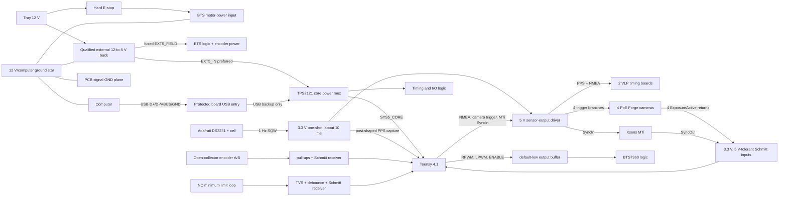
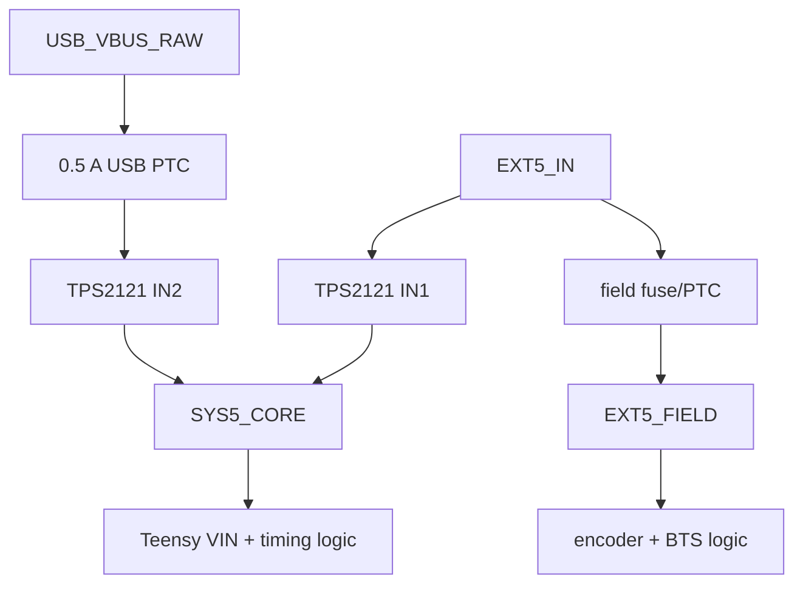

# Heron V6 timing and motion circuit

**Document role:** source-of-truth explanation of the V6 electrical design
**Revision:** V6 logical architecture
**Updated:** 2026-08-25
**Applies to:** 2 VLP-16s, 1 Xsens MTi, 4 FLIR Forge cameras, 1 BTS7960/IBT-2 motor driver, 1 A/B encoder, and 1 normally-closed limit switch

> Update this file and `timing_circuit.pdf` whenever the V6 schematic, connector pinout, Teensy pin assignment, power architecture, or firmware safety contract changes.

## Release status

This document defines the target V6 circuit. It is ready for schematic review, but it is **not yet a fabrication release**. Fabrication requires the older isolated/USB-only KiCad design to be replaced, whole-hierarchy ERC = 0, a fully routed board with DRC = 0 and zero unrouted connections, verified footprints, and completion of the bench gates below.

## Requirements

V6 must:

- align two VLP-16s, four cameras, and one MTi to a defensible common local timebase;
- capture actual camera/IMU feedback events instead of using packet-arrival time;
- control the BTS7960 and count the existing 600 P/R A/B encoder;
- block motion toward the installed minimum when the normally-closed limit loop opens;
- default all motion outputs low during reset, faults, or missing commands;
- accept external 5 V as the preferred supply while USB backs up only the timing core;
- prevent 5 V backfeed and keep motor current out of PCB/USB/sensor grounds;
- power no PoE camera and carry no 12 V or motor power on this PCB;
- add no undefined knob, selector, or RC interface.

The DS3231 supplies a stable common local epoch, not GNSS-disciplined UTC.

## Complete logical circuit

The PCB ground is a signal reference. BTS B-/B+/M+/M- use separate heavy conductors. Motor return current must never use a PCB trace, USB cable, sensor return, or Teensy ground pin.

## Power, USB, and ground

- TPS2121 gives external-5-V priority, reverse-current blocking, current limiting, and USB backup for the core.
- USB-only operation must never energize `EXT5_FIELD`, encoder VCC, or BTS logic VCC.
- USB VBUS continues to the Teensy USB receptacle for USB attach behavior, but never joins VIN directly.
- Cut the Teensy 4.1 `VUSB-VIN` link and meter-prove the cut before connecting both sources.
- D27/A13 measures `EXT5_IN`; firmware forces motor enable low when field power is absent or out of range.
- Use 47-100 uF core bulk, 1 uF at the mux, and 100 nF at every IC. Final fuse values follow load and inrush measurements.

The anonymous external buck is accepted only after polarity, 4.75-5.25 V loaded output, ripple, temperature, maximum-load behavior, and input/output ground continuity are measured. This architecture is shared-ground, not isolated.

## Teensy pin contract

| Pin | Signal | Direction | Purpose |
| --- | --- | --- | --- |
| D1 / Serial1 TX | shared VLP NMEA | out | One hardware UART stream fans to both VLPs |
| D12 | shaped PPS capture | in | Captures the same post-one-shot edge delivered to both VLPs |
| D11 | common camera trigger | out | Four hardware-buffered branches |
| D14-D17 | camera 1-4 feedback | in | Separate ExposureActive timestamps |
| D5 / D4 | MTi SyncIn / SyncOut | out / in | IMU event command and evidence |
| D22 / D23 | BTS RPWM / LPWM | out | PWM and direction under firmware control |
| D38 | BTS common enable | out | Fans to R_EN and L_EN; default low |
| D30 / D31 | encoder A / B | in | Quadrature capture |
| D34 | minimum limit tripped | in | Open NC loop means trip/fault |
| D27 / A13 | external 5 V monitor | in | Prevents USB backup from enabling motion |
| D18 / D19 | RTC SDA / SCL | bidirectional | Native I2C at 3.3 V |

Timed outputs and motion remain fail-closed until wiring, polarity, device settings, geometry, encoder sign, blocked motor direction, and hard E-stop operation are verified.

## RTC and PPS one-shot

The owned Adafruit DS3231 product 3013 module and coin cell are retained. Its PCB envelope is approximately 22.86 x 17.78 mm with the exact header, holes, and battery clearance represented in the footprint. Power it from 3.3 V so its onboard I2C pull-ups cannot expose Teensy pins to 5 V.

The open-drain `SQW` output uses a 4.7 kOhm pull-up to 3.3 V and drives an SN74LVC1G123. A nominal 100 kOhm/100 nF network makes an approximately 10 ms PPS. That is pulse width, not start delay; the leading edge is delayed only by nanosecond-scale logic propagation. Scope-confirm the width and both loaded outputs.

## Two VLP-16s

| J2 pin | Function |
| --- | --- |
| 1-3 | VLP1 M12 pin 5 serial, pin 6 PPS, pin 8 signal return |
| 4-6 | VLP2 M12 pin 5 serial, pin 6 PPS, pin 8 signal return |

The third conductor per VLP is required: do not use Ethernet shielding as the timing reference. One PPS fans to two protected branches; one UART NMEA stream fans to both LiDARs. Each branch uses connector-local TVS, a small series resistor, and a characterized load. Starting values are 180 Ohm series and 2.2 kOhm to ground.

Loaded outputs must satisfy VLP limits: high above 3.0 V and below 5.0 V, low below 1.2 V, and at least 2 mA high-state drive. Verify UART polarity on the exact Teensy core/VLP interface and never bit-bang NMEA. Emit nonblocking NMEA after the PPS trailing-edge margin and finish at least 300 ms before the next PPS.

## Four Forge cameras

The PoE cameras receive no power from V6. Each camera uses four J5 conductors:

| M8 pin | Function |
| --- | --- |
| 2 | OPTOIN configured as FrameStart |
| 3 | OPTOGND |
| 6 | OPTOOUT configured as ExposureActive |
| 7 | camera/output GND |

The four-position pattern repeats for cameras 1-4, so J5 has 16 positions. Do not merge pins 3 and 7 without an authoritative circuit drawing and bench test.

Four output-driver channels create closely aligned trigger edges. Each branch has a default-low resistor, 100-220 Ohm series resistance, and connector-local TVS. Four separate 3.3 V, 5.5 V-tolerant Schmitt inputs capture OPTOOUT. Firmware records command and feedback; the camera's approximately 7-25 us optocoupler delay dominates the board's nanosecond-scale delay.

## Xsens MTi

| J3 pin | Function |
| --- | --- |
| 1 | Fischer pin 5 SyncIn |
| 2 | Fischer pin 6 SyncOut |
| 3 | common ground |

SyncIn is a protected, buffered 5 V-compatible output. SyncOut feeds a protected, 3.3 V-powered, 5.5 V-tolerant Schmitt receiver. Firmware must account for any receiver inversion. The MTi remains continuously sampled; SyncIn marks a configured event and SyncOut provides evidence. Verify the exact installed MTi model and `SyncSettings` in MT Manager before enabling it.

## BTS7960 motor interface

| J101 pin | Function |
| --- | --- |
| 1-4 | RPWM, LPWM, R_EN, L_EN |
| 5-6 | EXT5_FIELD, GND |

R_EN and L_EN share one buffered `BTS_ENABLE`. Connector-side pulldowns hold all commands low during reset or disconnection. Teensy firmware owns mutual exclusion, acceleration limiting, command timeout, break-before-make, limit direction gating, homing, and stall detection. The independent hard E-stop remains in the 12 V motor-power path. R_IS/L_IS are omitted until the exact IBT-2 clone has a verified current-sense contract.

## Encoder

| J102 pin | Function |
| --- | --- |
| 1-4 | EXT5_FIELD, GND, A/white, B/green |

The Taiss encoder is a 5-24 V, 600 P/R, NPN open-collector A/B encoder; red is power, black ground, white A, green B, and there is no Z. A and B use 3.3 V pull-ups, TVS, small series resistors, and a dual Schmitt receiver. Teensy counts edges in interrupts and publishes bounded-rate state; it must not stream every edge. At 6300 rpm with x4 decoding, the worst case is about 252,000 edges/s.

## Normally-closed limit

| J103 pin | Function |
| --- | --- |
| 1-2 | NC-loop signal, GND/COM |

The healthy closed loop reads inactive. Actuation, unplugging, or a broken wire opens it and reads tripped. Use pull-up, TVS, series resistance, 1-10 nF mechanical debounce, and a Schmitt receiver. This deliberate microsecond-scale filter is only on the mechanical safety input. Firmware blocks motion toward minimum while permitting controlled motion away.

## Components and why they exist

| Function | Preferred part | Reason |
| --- | --- | --- |
| Core source selection | TPS2121 | External priority, USB backup, reverse blocking, protection |
| PPS shaping | SN74LVC1G123 | Converts 1 Hz SQW to repeatable short PPS |
| Sensor outputs | SN74AHCT244 | 3.3 V logic input and qualified 5 V-compatible sensor drive |
| Camera/MTi/limit inputs | SN74LVC14A | Six 5.5 V-tolerant Schmitt inputs |
| Encoder inputs | SN74LVC2G17 | Two 5.5 V-tolerant non-inverting Schmitt inputs |
| Motor outputs | SN74AHCT125 | Three default-low BTS commands plus spare |
| USB ESD | USBLC6-2SC6 | Low-capacitance D+/D- protection |
| VLP/camera ESD arrays | TPD4E05U06 | Four lines per connector-local package |
| MTi/encoder arrays | TPD2E2U06 | Two lines per connector-local package |
| Limit ESD | TPD1E10B06 | One protected line |

Protection order is connector -> TVS with shortest ground return -> series resistor -> driver/receiver. A remote consolidated protection box would be ineffective. No RC filter is placed on PPS, NMEA, camera, MTi, or encoder timing. Board logic delay is single-digit to low tens of nanoseconds.

## Measurement-time contract

| Device | Command/reference | Returned evidence | Meaning |
| --- | --- | --- | --- |
| VLP x2 | shaped PPS + common NMEA | sensor packet timestamp | common local RTC epoch, not GNSS UTC |
| Camera x4 | common trigger | separate ExposureActive pulse | exposure event after characterized opto delay |
| MTi | SyncIn | SyncOut | configured IMU sync event |
| Encoder | none | counted A/B transitions | sampled position/velocity on Teensy monotonic time |
| Limit | none | accepted NC-loop transition | safety event after debounce |

Records need a monotonic event ID, Teensy timestamp, channel, edge/state, scheduler status, and overflow/fault state. Host software maps the Teensy epoch to its own clock; it does not replace measurement time with USB/Ethernet arrival.

## PCB placement

- J2 faces the adjacent LiDAR interface boards.
- J101/J102/J103 and the field fuse face the BTS/encoder/limit harness.
- J5 faces the camera bulkhead; J3 faces the MTi cable.
- USB, external 5 V, and TPS2121 share the service edge.
- Teensy is central; RTC, one-shot, and sensor-output buffer sit near D1/D11/D12.
- TVS arrays sit within millimeters of their connectors.
- Use four layers and a solid ground plane; route USB D+/D- first, then power, PPS/NMEA, camera/MTi, encoder, and motor/limit.
- Put tall parts on top and only small SMD parts underneath.
- Shrink the board only after full routing and cable-access review; do not force 100 x 64 mm at the expense of return paths.

No knob or switch is currently justified. Add labeled test points for all rails and major timing/motion nets. A future RC input may be a three-pin DNP reservation only after receiver voltage/protocol are known.

## Required failure behavior

| Failure | Behavior |
| --- | --- |
| USB lost, external 5 V healthy | core remains alive; command watchdog disables motor |
| External 5 V lost, USB remains | timing core may remain; field rail dies; motor enable forced low |
| Both sources absent | board off; hard E-stop remains independent |
| Teensy reset/high-Z | pulldowns hold RPWM, LPWM, enable low |
| Limit loop opens | tripped; motion toward minimum blocked |
| Encoder stops during motion | stall fault |
| Camera/MTi feedback missing | timing fault; no invented event |
| Event queue overflows | explicit latched fault |

## Bench and release gates

- [ ] Qualify the external buck and measure computer-ground to tray-star voltage before USB connection.
- [ ] Prove the Teensy VUSB-VIN cut.
- [ ] Test external-only, USB-only, and both-source cases with no backfeed; USB-only must not power field loads.
- [ ] Scope SQW, one-shot PPS, D12 capture, both loaded VLP PPS branches, and NMEA polarity/timing.
- [ ] Measure four-camera trigger skew and capture all ExposureActive returns.
- [ ] Verify the MTi model, settings, levels, and polarity.
- [ ] Test encoder maximum rate, sign, bounded telemetry, and stall behavior.
- [ ] Prove limit open-circuit, blocked-direction, reset, command-timeout, USB-loss, and hard-E-stop behavior.
- [ ] Replace the old isolated KiCad design; remove TMR0511, ISO7760s, FIELD_GND, isolation moat, and obsolete motor gates.
- [ ] Verify exact footprints, reach ERC = 0, route every net, and reach DRC = 0.

## References

- [TI TPS2121](https://www.ti.com/lit/ds/symlink/tps2121.pdf)
- [TI SN74LVC14A](https://www.ti.com/lit/ds/symlink/sn74lvc14a.pdf)
- [TI SN74LVC2G17](https://www.ti.com/lit/ds/symlink/sn74lvc2g17.pdf)
- [TI SN74AHCT125](https://www.ti.com/lit/ds/symlink/sn74ahct125.pdf)
- Teledyne FLIR Forge FG-PGE-50S5-IP Technical Reference, Digital I/O Control
- Velodyne VLP-16 User Manual, GPS/PPS/NMEA electrical and timing requirements
- Xsens MTi User Manual and installed-model SyncSettings documentation

## Maintenance rule

Markdown is the editable source of truth. After an electrical or firmware-interface change: update this file and revision/date; update KiCad and run ERC; update connector and Teensy contracts; update `sensor_timing.md`, `telescope.md`, and firmware configuration as needed; regenerate `timing_circuit.pdf`; visually inspect every page; and keep CAD/software evidence distinct from physical validation.
