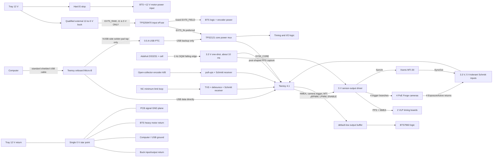
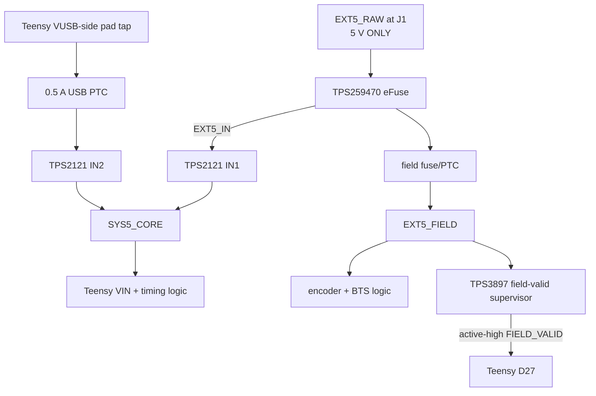

# Heron V6 timing and motion circuit

**Document role:** source-of-truth explanation of the V6 electrical design
**Revision:** V6 CAD review candidate
**Updated:** 2026-08-26
**Applies to:** 2 VLP-16s, 1 Xsens MTi-30, 4 FLIR Forge cameras, 1 BTS7960/IBT-2 motor driver, 1 A/B encoder, and 1 normally-closed limit switch

> Update this file and `timing_circuit.pdf` whenever the V6 schematic, connector pinout, Teensy pin assignment, power architecture, or firmware safety contract changes.

## Release status

This document defines the target V6 circuit. V6 is a **CAD review candidate** as of 2026-08-26: the canonical project reports whole-hierarchy ERC = 0 errors/0 warnings and PCB DRC = 0 violations with schematic parity, all-track checks, zero unconnected pads, and zero footprint errors. All 12 D1-D3 channels also pass bridge-removal flow-through audits. It is neither fabrication-ready nor field-ready until the physical-fit and bench gates below are completed.

## Requirements

V6 must:

- align two VLP-16s, four cameras, and one MTi to a defensible common local timebase;
- capture actual camera/IMU feedback events instead of using packet-arrival time;
- control the BTS7960 and count the existing 600 P/R A/B encoder;
- block motion toward the installed minimum when the normally-closed limit loop opens;
- default all motion outputs low during reset, faults, or missing commands;
- accept external 5 V as the preferred supply while USB backs up only the timing core;
- prevent 5 V backfeed and keep motor current out of PCB/USB/sensor grounds;
- power no PoE camera and carry no 12 V or motor power on this PCB;
- add no undefined knob, selector, or RC interface.

The DS3231 supplies a stable common local epoch, not GNSS-disciplined UTC.

## Complete logical circuit

The PCB ground is a signal reference. BTS B-/B+/M+/M- use separate heavy conductors. Motor return current must never use a PCB trace, USB cable, sensor return, or Teensy ground pin.

## Power, USB, and ground

- J1 is labeled **5 V ONLY**. A TPS259470 eFuse immediately after J1 protects both downstream branches. Its nominal EN/UVLO turn-on is 4.547 V, nominal overvoltage cutoff is 5.302 V, and nominal current limit is about 1.51 A. Including comparator, 0.1% divider, and pin-leakage tolerances, the expected UVLO and OVLO rising ranges are approximately 4.406-4.710 V and 5.142-5.489 V. The threshold network is 374 kOhm / 19.1 kOhm / 115 kOhm at 0.1%; use 2.21 kOhm at `ILM`, 2.2 nF C0G at `dVdt`, exact C14/C15 TDK C3216X7R1H225K160AB 2.2 uF +/-10%, X7R, 50 V, 1206 input/output capacitors, and leave `ITIMER`, `AUXOFF`, and `FLT` open. The approximately 5.5 ms controlled rise occurs only at power-up and adds no sensor-signal delay. EN/UVLO falling is roughly 4.15 V because of U11's internal hysteresis, so U11 alone is not proof that 5 V field logic remains in its guaranteed range and must not be described as always disconnecting before AHCT falls below 4.5 V. U12 `FIELD_VALID`, near 4.7 V, is the runtime field-logic validity gate.
- The eFuse is last-resort board protection, not a 12 V regulator. J1 requires a **4.95-5.05 V instantaneous loaded envelope**, including DC set-point error, ripple, overshoot, undershoot, and every operating transient; fuse the buck's 12 V feed upstream. Do not intentionally apply 12 V to J1. After OVLO, remove the source or bring it below the nominal approximately 4.82 V recovery level before restart.
- TPS2121 gives external-5-V priority, reverse-current blocking, current limiting, and USB backup for the core.
- USB-only operation must never energize `EXT5_FIELD`, encoder VCC, or BTS logic VCC.
- Total `EXT5_FIELD` current must remain at or below 250 mA across every operating mode. TP4 must remain at or above 4.80 V under the worst simultaneous field load and worst qualified temperature. During qualification, log the voltage drop across and temperature of both U11 and F2. If the measured or credible worst-case field load exceeds 250 mA, stop and reassess the load budget, F2, U11, rail-drop, and thermal design rather than increasing a fuse value by assumption.
- The computer's normal shielded cable plugs directly into the Teensy onboard Micro-B receptacle. V6 carries no USB D+/D- or shield traces, no second USB receptacle, and no internal USB data pigtail.
- A short, insulated, strain-relieved 24-28 AWG wire from the exact Teensy underside VUSB-side test/cut pad to the carrier's single VUSB-tap solder pad supplies only the USB backup path. Never tap the VIN side of the cut.
- Cut the Teensy 4.1 `VUSB-VIN` link and meter-prove the cut before connecting both sources.
- U12 TPS3897ADRYT supervises `EXT5_FIELD`. R48 84.5 kOhm and R49 10.0 kOhm, both 0.1%, give 4.725 V nominal rising and 4.678 V nominal falling thresholds; the tolerance-plus-`I_SENSE` rising range is approximately 4.668-4.782 V. C17 100 nF is its local VCC bypass. The roughly 40 us valid qualification is nominal/formula-based, not a guaranteed maximum. Its open-drain output, R62 10 kOhm core-3.3-V pull-up, and R64 100 kOhm pulldown create active-high D27 `FIELD_VALID`: LOW means invalid/off and remains fail-low with the core off. Invalid propagation is about 16 us typical, but the datasheet specifies no maximum; characterize assembled worst case and retain the independent hard E-stop. Q2 onsemi BSS138K uses `FIELD_VALID` to pull U3 pins 1/19 `U3_OE_N` low only while valid; R63 10 kOhm to `EXT5_FIELD` disables U3 when Q2 is off. All four U6 active-high OE pins use `FIELD_VALID` directly. These OE-only gates add no component to any signal data path. As secondary defense, a D27 falling-edge ISR performs only a shared-enable-low write and a one-bit latch; the 10 ms loop polls, clears motion/homing requests, and zeroes both PWM channels. Restoration requires a fresh command. With the core off and the nominal field rail present, R48 bounds hypothetical sense-clamp feed to no more than 59 uA; this is not a zero-Ioff claim.
- Firmware also treats `FIELD_VALID` as a prerequisite for every field-timed path. While it is LOW, camera/MTi events and LiDAR reference/NMEA work are dropped, the relative epoch is discarded, the timing runtime reports `field_power_invalid`, and scheduled field outputs remain inactive. This is secondary diagnostic defense behind the U3/U6 hardware OE gates.
- Use 47-100 uF core bulk, 1 uF at the mux, and 100 nF at every IC. Final fuse values follow load and inrush measurements.

The external buck is accepted only after the complete assembled load demonstrates the 4.95-5.05 V instantaneous J1 envelope and its polarity, ripple, overshoot, undershoot, temperature behavior, maximum-load response, and input/output ground continuity are measured. An unqualified anonymous module is not acceptable. This architecture is shared-ground, not isolated.

## Teensy pin contract

| Pin | Signal | Direction | Purpose |
| --- | --- | --- | --- |
| D1 / Serial1 TX | shared VLP NMEA | out | One firmware-peripheral-inverted UART stream fans through non-inverting drivers to both VLPs |
| D12 | shaped PPS capture | in | Captures the same post-one-shot edge delivered to both VLPs |
| D11 | common camera trigger | out | Four hardware-buffered branches |
| D14-D17 | camera 1-4 feedback | in | Separate ExposureActive timestamps |
| D5 / D4 | MTi SyncIn / SyncOut | out / in | IMU event command and evidence |
| D22 / D23 | BTS RPWM / LPWM | out | PWM and direction under firmware control |
| D38 | BTS common enable | out | Fans to R_EN and L_EN; default low |
| D30 / D31 | encoder A / B | in | Quadrature capture |
| D34 | minimum limit tripped | in | Open NC loop means trip/fault |
| D27 / A13 | `FIELD_VALID` | in | TPS3897 open-drain supervisor output; high=qualified field, low=invalid/off; R62/R64 bias the board node and the MCU uses a plain input, so D27-branch continuity is required for firmware evidence |
| D18 / D19 | RTC SDA / SCL | bidirectional | Native I2C at 3.3 V |

Timed outputs and motion remain fail-closed until wiring, polarity, device settings, geometry, encoder sign, blocked motor direction, and hard E-stop operation are verified.

## RTC and PPS one-shot

The intended retained module is the original Adafruit DS3231 product 3013 with coin cell. The official Eagle source defines a 22.86 x 17.78 mm outline with 2.54 mm corner radii, a 1x8 header on 2.54 mm pitch, and two 2.5 mm plated mounting holes at (2.54, 15.24) and (20.32, 15.24) mm from the lower-left datum. The carrier footprint reproduces that geometry and reserves battery/body clearance. Power it from 3.3 V so its onboard I2C pull-ups cannot expose Teensy pins to 5 V. Before fabrication, confirm the installed module is product 3013 and perform a physical print/fit check; the larger product 5188 STEMMA variant does not fit this footprint.

The open-drain `SQW` output uses a 4.7 kOhm pull-up to 3.3 V. Its falling edge triggers an SN74LVC1G123, whose active-high output rises to create `PPS_MASTER`. The DS3231 datasheet places the 1 Hz square-wave high transition approximately 500 ms after the seconds-register transfer, so using the falling edge supports association with the next divider boundary; it does not prove exact unmeasured phase. A nominal 100 kOhm/100 nF network makes an approximately 10 ms PPS. That is pulse width, not start delay; the leading edge is delayed only by nanosecond-scale logic propagation. Teensy D12 captures the shaped rising edge. Scope the assembled SQW against RTC register rollover and `PPS_MASTER`, then confirm the width and both loaded outputs before making any timing claim. The battery-backed RTC can retain square-wave mode; firmware now probes it on every boot and requests `DS3231_OFF` whenever all timing gates are false. This cannot suppress a pre-initialization edge or prove shutdown if the RTC is unreachable, so hardware gating and scope verification remain release gates.

R61 is a 10 kOhm `PPS_MASTER` pulldown physically beside the U3 inputs. If `EXT5_FIELD` powers U3 while the core/one-shot is off, R61 holds both LiDAR PPS branches low rather than allowing a floating startup pulse.

## Socketed modules and assembly

U2 Teensy 4.1 is removable. Use either a bare Teensy populated with two Amphenol 68000-224HLF 1x24 male header rows or a Teensy supplied with male pins; both mate to two Sullins PPPC241LFBN-RC 1x24 carrier sockets. The U2 carrier holes use 1.016 mm drills. U8 Adafruit DS3231 product 3013 uses its included 1x8 male header and mates to one Sullins PPPC081LFBN-RC 1x8 carrier socket.

Perform and meter-prove the Teensy `VUSB-VIN` cut, then solder, insulate, and strain-relieve the VUSB-side tap before inserting U2 into its carrier sockets. Fabrication release requires a physical stack-up check with the exact headers, sockets, modules, standoffs, host USB plug, and cable bend: confirm tray-wall and bottom clearance, Micro-B access, and U8 coin-cell/body clearance without loading the boards or trapping the battery.

## Two VLP-16s

| J2 pin | Function |
| --- | --- |
| 1-3 | VLP1 M12 pin 5 serial, pin 6 PPS, pin 8 signal return |
| 4-6 | VLP2 M12 pin 5 serial, pin 6 PPS, pin 8 signal return |

The third conductor per VLP is required: do not use Ethernet shielding as the timing reference. One PPS fans to two protected branches; one UART NMEA stream fans to both LiDARs. The RTC/one-shot is a shared physical source, so enabling common timing for the cameras or MTi also drives both VLP PPS branches whenever `FIELD_VALID` is high; the firmware LiDAR gate is diagnostic/scheduling state, not an independent physical disconnect. Both branches must therefore be safely wired and commissioned before any common timing output is enabled. Each branch uses connector-local TVS, R10-R13 220 Ohm, 1% series damping, and R14-R17 10 kOhm, 1% pulldowns for a defined idle-low state. The 220 Ohm value is deliberate: at the 5.05 V rail maximum and worst resistor tolerances, the zero-sensor-load connector bound is 4.944 V, below the VLP's strict 5.0 V ceiling. Using the SN74AHCT244 full-temperature 3.8 V minimum `VOH` at 8 mA as a conservative source bound, the connector remains above 3.27 V while supplying the required 2 mA plus its pulldown current. The VLP manual's at-least-2-mA high-state figure is a required driver capability, not a reason to add a 2.2 kOhm external load. The resistor adds no fixed logic delay; its cable-dependent edge slew must still be measured. Verify loaded high/low levels, rise/fall time, current, and overshoot on both assembled harnesses before release.

Loaded outputs must satisfy VLP limits: high above 3.0 V and below 5.0 V, low below 1.2 V, and at least 2 mA high-state drive. V6 assigns inversion to the Teensy Serial1 peripheral and uses non-inverting AHCT fanout; do not populate a second inverter. Verify polarity on the exact Teensy-core/VLP interface and never bit-bang NMEA. The bounded firmware path schedules status-V GPRMC 100 ms after the shaped PPS leading edge. It deliberately preserves status `V` and blank position fields because the RTC is not a valid GNSS receiver; never fabricate status `A`. On each VLP, read back and save both the PPS Qualifier and GPS Qualifier `Require GPS Receiver Valid` settings as OFF before enabling this RTC-only stream. Defaults are not evidence. Verify delayed PPS Locked state, packet PPS status 2, and copied RMC/time continuity separately on both units. With the nominal 10 ms one-shot, NMEA begins about 90 ms after the PPS trailing edge, rather than relying on the VLP Rev-F 50 ms minimum. Firmware refuses a late start after 200 ms and aborts any tail not enqueued by 500 ms. Its conservative 80-byte/9600-baud bound is 83,334 us, so even the minimum accepted 900 ms reference period retains the final 300 ms quiet window. The sentence carries the next PPS second with calendar rollover.

## Four Forge cameras

The PoE cameras receive no power from V6. J5 carries cameras 1-2 and the touching J7 carries cameras 3-4. Each camera uses three conductors:

| M8 pin | Function |
| --- | --- |
| 2 | OPTOIN configured as FrameStart |
| 3 | OPTOGND |
| 6 | OPTOOUT configured as ExposureActive |

Within each 1x6 connector, pins 1-3 carry the first camera and pins 4-6 carry the second in the M8-pin-2, M8-pin-3, M8-pin-6 order. J5 and J7 therefore provide 12 positions total. Each M8 pin 3 OPTOGND is bonded to board signal ground. Camera-power ground on M8 pin 7 is not carried or bonded. Each open-collector OPTOOUT gets its own starting-value 1.0 kOhm pull-up to board 3.3 V referenced to OPTOGND, followed by connector-local protection, series resistance, and the exact SN74LV14APWR receiver. U4's Ioff partial-power-down behavior prevents externally present camera, MTi, or limit signals from back-powering an unpowered 3.3 V core. Characterize sink current and rise time on the actual cable before release.

Four output-driver channels create closely aligned trigger edges. A common 10 kOhm pulldown holds D11's trigger command low during reset; each buffered branch has 100-220 Ohm series resistance and connector-local TVS. R66-R69 are separate 10 kOhm connector-side pulldowns on `CAM1_OPTOIN` through `CAM4_OPTOIN`; they hold every camera trigger low during MCU reset/high-Z, core-off, driver-disable, or an open harness. These are static fail-low loads, not RC timing filters. Four separate 3.3 V Schmitt inputs capture the pulled-up OPTOOUT lines. Firmware records command and feedback; the camera's approximately 7-25 us optocoupler delay dominates the board's nanosecond-scale delay. The disabled-by-default scheduler uses a 200 ms period (5 Hz) to match the checked-in Forge acquisition-rate target; host camera triggering remains unchanged until the device configuration and feedback path are commissioned together.

## Xsens MTi-30

| J3 pin | Function |
| --- | --- |
| 1 | Fischer pin 5 SyncIn |
| 2 | Fischer pin 6 SyncOut |
| 3 | common ground |

Live USB and udev inspection on 2026-08-26 confirmed the installed device identifies as an Xsens MTi-30 AHRS. Its serial identity remains host inventory, not a V6 electrical requirement. The existing USB cable continues carrying IMU data; J3 carries only SyncIn, SyncOut, and signal return. SyncIn is a protected, buffered 5 V-compatible output; R65 is a 10 kOhm connector-side pulldown that holds `MTI_SYNCIN` low during MCU reset/high-Z, core-off, driver-disable, or an open harness. SyncOut feeds a protected, 3.3 V-powered, 5.5 V-tolerant Schmitt receiver. A separate 10 kOhm receiver-side pulldown makes an open SyncOut cable deterministic low before inversion, so the MCU idles high instead of timestamping a floating line. Firmware accounts for the receiver inversion. The MTi remains continuously sampled; SyncIn marks a configured event and SyncOut provides evidence. Verify the selected `SyncSettings`, levels, cable pins, polarity, and packet marker in MT Manager before enabling it.

## BTS7960 motor interface

| J101 pin | Function |
| --- | --- |
| 1-4 | RPWM, LPWM, R_EN, L_EN |
| 5-6 | EXT5_FIELD, GND |

R_EN and L_EN share one buffered `BTS_ENABLE`. Three SN74AHCT126 channels drive RPWM, LPWM, and the shared enable; its fourth channel drives MTi SyncIn. Connector-side pulldowns hold all commands low during reset or disconnection. Teensy firmware owns mutual exclusion, acceleration limiting, command timeout, break-before-make, limit direction gating, homing, and stall detection. The independent hard E-stop remains in the 12 V motor-power path. Both `hardware.yaml::hard_estop_installed_and_tested` and firmware `kHardEstopVerified` are false by default; the runtime refuses motion until the firmware gate is true, which may happen only after a physical test proves the normally-closed E-stop removes 12 V motor power independently of the MCU, USB, driver logic, and software. V6 has no motor-current sensor and does not connect R_IS/L_IS; the retained compatibility topic reports unavailable data.

## Encoder

| J102 pin | Function |
| --- | --- |
| 1-4 | EXT5_FIELD, GND, A/white, B/green |

The Taiss encoder is a 5-24 V, 600 P/R, NPN open-collector A/B encoder; red is power, black ground, white A, green B, and there is no Z. A and B use 3.3 V pull-ups, TVS, small series resistors, and a dual Schmitt receiver. Teensy counts edges in interrupts and publishes bounded-rate state; it must not stream every edge. At 6300 rpm with x4 decoding, the worst case is about 252,000 edges/s.

## Normally-closed limit

| J103 pin | Function |
| --- | --- |
| 1-2 | NC-loop signal, GND/COM |

The healthy closed loop reads inactive. Actuation, unplugging, or a broken wire opens it and reads tripped. Use a 10 kOhm pull-up, TVS, 1 kOhm series resistance, about 4.7 nF at the Schmitt input, and an inverting receiver. This deliberate microsecond-scale filter is only on the mechanical safety input. Firmware accepts the active-low trip immediately on its next control pass, debounces only the return to healthy, and blocks motion toward minimum while permitting separately commissioned motion away. Because one NC contact cannot distinguish a true minimum from a broken cable, encoder rebasing is allowed only during an explicit homing request and the ambiguity remains a bench-test/mechanical-hard-stop risk.

## Components and why they exist

| Function | Preferred part | Reason |
| --- | --- | --- |
| External-input protection | TPS259470ARPWR | Disconnects reversed, overvoltage, and overcurrent input before either board branch; soft-start is power-up-only |
| Core source selection | TPS2121 | External priority, USB backup, reverse blocking, protection |
| PPS shaping | SN74LVC1G123 | Converts 1 Hz SQW to repeatable short PPS |
| Sensor outputs | SN74AHCT244 | Eight channels exactly: two PPS, two NMEA, and four camera triggers |
| Camera/MTi/limit inputs | SN74LV14APWR | Six inverting Schmitt channels with Ioff: four camera returns, MTi SyncOut, and NC limit |
| Encoder inputs | SN74LVC2G17 | Two 5.5 V-tolerant non-inverting Schmitt inputs |
| Motor/MTi outputs | SN74AHCT126 | RPWM, LPWM, shared BTS enable, and MTi SyncIn |
| Field-valid supervisor | TPS3897ADRYT | Qualifies EXT5_FIELD before motion; about 40 us valid delay and 16 us invalid delay are nominal/typical only, with no datasheet invalid-delay maximum, so assembled worst case must be measured |
| Field-valid hardware gates | BSS138K + R63 10 kOhm + R64 100 kOhm | Fail-disable U3 and U6 during invalid/core-off states by controlling OE only, with no added signal-path component or delay |
| VLP/camera ESD arrays | D1-D3 TPD4E05U06 in the project-owned TI DQA A/B-compatible footprint | Four protected lines per connector-local package; the owned footprint removes package-variant ambiguity |
| MTi/encoder arrays | TPD2E2U06 | Two lines per connector-local package |
| Limit ESD | PESD5V0S1BA | One protected line |
| Sensor-output fail-low loads | R65-R69, 10 kOhm | Connector-side static pulldowns hold MTi SyncIn and all four camera OPTOIN branches inactive during reset, high-Z, core-off, driver-disable, or open harnesses without adding an RC timing filter |

Protection order is connector -> TVS with shortest ground return -> series resistor -> driver/receiver. Each of the 12 D1-D3 channels must be a real flow-through route: connector -> NC-side pad 10/9/7/6 -> straight under-package copper -> paired I/O pad 1/2/4/5 -> downstream logic. Pads 3/8 require short local vias into the ground plane, and alternate same-net copper must not bypass the package. A remote consolidated protection box would be ineffective. No RC filter is placed on PPS, NMEA, camera, MTi, or encoder timing. Board logic delay is single-digit to low tens of nanoseconds.

## Measurement-time contract

| Device | Command/reference | Returned evidence | Meaning |
| --- | --- | --- | --- |
| VLP x2 | shaped PPS + common status-V NMEA | sensor packet timestamp, PPS status, copied RMC | common local RTC epoch after per-unit qualifier/lock verification, not GNSS UTC or position validity |
| Camera x4 | common trigger | separate ExposureActive pulse | exposure event after characterized opto delay |
| MTi | SyncIn | SyncOut | configured IMU sync event |
| Encoder | none | counted A/B transitions | sampled position/velocity on Teensy monotonic time |
| Limit | none | accepted NC-loop transition | open means trip on the next 10 ms control pass; only healthy release is debounced |
| DT100 / Ping360 | none in V6 | host/driver timestamp | intentionally asynchronous; fuse against the continuous-time trajectory |

Records need a monotonic event ID, Teensy timestamp, channel, edge/state, scheduler status, and overflow/fault state. Host software maps the Teensy epoch to its own clock; it does not replace measurement time with USB/Ethernet arrival.

DT100 and Ping360 are intentionally not wired to V6 in this revision. This is a safety boundary, not a claim that hardware synchronization is impossible: the DT100 has Sync IN/OUT circuitry, but a vendor report identified damage after power was applied to those lines. Do not drive either DT100 sync pin until its exact connector, polarity, voltage levels, direction, and common-reference requirements are vendor-verified. The current safe contract uses host/driver timestamps and asynchronous or continuous-time fusion for both sonars.

## PCB placement

- J2 faces the adjacent LiDAR interface boards.
- J101/J102/J103 and the field fuse face the BTS/encoder/limit harness.
- Touching J5/J7 face the camera bulkhead; J3 faces the MTi cable.
- J1, TPS259470, the USB-backup tap, and TPS2121 share the service edge.
- The Teensy onboard Micro-B receptacle is accessible at the left board edge with plug and bend clearance. Its normal shielded cable connects directly to the computer.
- Teensy is central; RTC, one-shot, and sensor-output buffer sit near D1/D11/D12.
- TVS arrays sit within millimeters of their connectors.
- The frozen board outline is **110 x 90 mm** on four layers with a solid `In1.Cu` ground plane. The four M3 centers are (14, 14), (116, 14), (14, 96), and (116, 96) mm in the CAD coordinate system; each is a 3.2 mm NPTH with a 6.5 mm all-layer keepout. The final route keeps signals off `In1.Cu`, uses 946 track segments and 133 vias, and carries no USB data traces.
- Phoenix SPTA terminal footprints use the manufacturer's official asymmetric 65-degree, 10 mm body geometry and 1.1 mm drills. Top-edge connectors rotate 180 degrees and face outward; bottom-edge connectors remain at 0 degrees and face outward. Preserve at least 1.30 mm body-to-board-edge and 1.05 mm courtyard-to-board-edge clearance. Installed height is 12.4 mm and the required wire strip length is 8 mm.
- Mount on insulating standoffs at least 6 mm tall and preserve at least 2 mm insulation/clearance from every through-hole tail to any conductive tray surface. Before release, dry-fit ferrule insertion, spring release-tool access, the host USB plug/cable bend, and RTC body/coin-cell access with the exact board, tray, standoffs, sockets, and harnesses.
- Place every fitted component on the top side. Reserve the bottom for copper and vias, and keep it assembly-clear against the tray floor.
- U2 and U8 remain socketed; reserve the exact module-stack, USB-plug/cable-bend, and RTC battery/body volumes in the enclosure model.

These dimensions and clearances are the physical CAD contract. The electronic CAD checks are complete, but the exact-part dry-fit, through-hole-tail/tray clearance, ferrule and release-tool access, module identification, and bench gates remain open.

No knob or switch is currently justified. Add labeled test points for all rails and major timing/motion nets. A future RC input may be a three-pin DNP reservation only after receiver voltage/protocol are known.

## Required failure behavior

| Failure | Behavior |
| --- | --- |
| J1 reversed, above configured OVLO, or over current | TPS259470 disconnects `EXT5_IN`; field power dies and the core may remain on USB backup |
| USB lost, external 5 V healthy | core remains alive; command watchdog disables motor |
| External 5 V becomes invalid, USB remains | supervisor drives `FIELD_VALID` low after about 16 us typical, with no datasheet maximum; U3/U6 hardware OEs then disable, the secondary falling-edge ISR removes motor enable, and the 10 ms loop clears the request/PWMs and discards timing epoch; independent hard E-stop remains required |
| Field rail restored | old motion request remains cleared; a fresh valid command is required |
| Both sources absent | board off; connector-side motor-command pulldowns and hard E-stop remain independent; R61 holds field-powered PPS branches low if the core alone is off; R65-R69 hold MTi SyncIn and all camera trigger branches low |
| Teensy reset/high-Z or core off | connector-side pulldowns hold RPWM, LPWM, enable, MTi SyncIn, and all four camera trigger branches low without firmware |
| D27 branch opens between the `FIELD_VALID` board node and MCU | firmware observation is indeterminate/unavailable, so this is a loss of firmware evidence rather than a guaranteed invalid reading; U3/U6 hardware OE control remains independently tied to the board node; route continuity, fault injection, and the independent hard E-stop are required |
| D27 shorts high or supervisor output fails open with R62 intact | can masquerade as valid; commissioning fault injection and the independent hard E-stop remain required |
| Limit loop opens | tripped; motion toward minimum blocked |
| Encoder stops during motion | stall fault |
| Camera/MTi feedback missing | timing fault; no invented event |
| Event queue overflows | explicit latched fault |

## Bench and release gates

- [ ] Qualify the upstream-fused external buck and measure computer-ground to tray-star voltage before USB connection.
- [ ] Across minimum/maximum input voltage, worst simultaneous load, startup, load steps, and the qualified temperature range, prove J1 remains inside 4.95-5.05 V instantaneously, total `EXT5_FIELD` current remains at or below 250 mA, and TP4 remains at or above 4.80 V. Log U11 and F2 voltage drops and temperatures. If field current exceeds 250 mA, stop and reassess before release.
- [ ] Fault-inject reverse input, 12 V miswire/failed-buck overvoltage, overload, and short circuit through a current-limited fixture; prove TPS259470 thresholds, restart behavior, and component temperatures without connected sensors or motor.
- [ ] Before inserting U2, prove the Teensy VUSB-VIN cut and the insulated, strain-relieved VUSB-side tap.
- [ ] Prove the VUSB tap is on the USB side of the cut, is fused at 0.5 A, is insulated/strain-relieved, and does not back-power the computer or field rail.
- [ ] Test external-only, USB-only, and both-source cases with no backfeed; USB-only must not power field loads.
- [ ] Scope SQW against RTC register rollover, then scope the one-shot PPS, D12 capture, both loaded VLP PPS branches, and NMEA polarity/timing; do not claim exact SQW phase before this measurement.
- [ ] Install a normally-closed hard E-stop in the 12 V motor-power path, physically prove that it removes motor power independently, and only then set both hard-E-stop commissioning gates true.
- [ ] On both VLPs, read back and save PPS Qualifier and GPS Qualifier `Require GPS Receiver Valid` = OFF; after the sensor's lock delay verify PPS Locked, packet PPS status 2, copied status-V RMC, and continuous time across `:58` to `:00` with no duplicate/skipped second. Preserve `V`; never fabricate `A` or position.
- [ ] Measure four-camera trigger skew and capture all ExposureActive returns.
- [ ] Verify MTi-30 settings, levels, cable pins, polarity, and packet marker.
- [ ] Prove R65-R69 hold `MTI_SYNCIN` and `CAM1_OPTOIN` through `CAM4_OPTOIN` low during reset/high-Z, core-off, driver-disable, and open-harness tests.
- [ ] Test encoder maximum rate, sign, bounded telemetry, and stall behavior.
- [ ] Prove D27 high only inside the qualified `EXT5_FIELD` range; measure the 4.668-4.782 V rising band, nominal 4.678 V falling threshold, nominal/formula-based 40 us qualification, and assembled worst-case invalid delay (16 us is typical only; no datasheet maximum). Continuity-test the complete board-node-to-D27 branch. Fault-inject field loss, a D27 branch open, D27 short-high, and supervisor-output stuck-open/low; confirm a branch open is treated as lost/indeterminate firmware evidence while the board-node U3/U6 OE gates still disable independently, then verify secondary interrupt handling, 10 ms polling backup, fresh-command recovery, and independent hard-E-stop behavior.
- [ ] Prove limit open-circuit, blocked-direction, reset/core-off, command-timeout, USB-loss, and hard-E-stop behavior.
- [ ] Confirm the final V6 remains the lean shared-ground design with no TMR0511, ISO7760, `FIELD_GND`, isolation moat, or obsolete motor gates.
- [ ] Verify the 110 x 90 mm four-layer outline, all four M3 centers, 3.2 mm NPTHs, 6.5 mm all-layer keepouts, Phoenix 65-degree body/orientation/edge-clearance contract, 1.1 mm terminal drills, 12.4 mm installed height, 8 mm strip length, insulating standoffs of at least 6 mm, and at least 2 mm through-hole-tail insulation from the conductive tray. Dry-fit ferrule insertion and release-tool access.
- [ ] Physically fit U2 with the selected Amphenol-or-supplied male rows and two PPPC241LFBN-RC sockets, verify every U2 drill is 1.016 mm, and fit U8's included 1x8 male header in a PPPC081LFBN-RC socket; prove tray, standoff, USB plug/cable, and RTC coin-cell/body clearance.
- [x] Complete the electronic CAD gate: assigned exact footprints include the project-owned TI DQA A/B-compatible footprint; whole-hierarchy ERC is 0/0; the board is fully routed; schematic-parity/all-track DRC is 0 with zero unconnected pads and zero footprint errors; and every D1-D3 channel passes the bridge-removal audit. Regenerate this evidence after any edit.

## References

- [TI TPS2121](https://www.ti.com/lit/ds/symlink/tps2121.pdf)
- [TI TPS25947 eFuse](https://www.ti.com/lit/ds/symlink/tps25947.pdf)
- [TI TPS3897 supervisor](https://www.ti.com/lit/ds/symlink/tps3897.pdf)
- [Adafruit DS3231 product-3013 PCB source](https://github.com/adafruit/Adafruit-DS3231-Precision-RTC-Breakout-PCB)
- [TI SN74LV14APWR family datasheet](https://www.ti.com/lit/ds/symlink/sn74lv14a.pdf)
- [TI SN74LVC2G17](https://www.ti.com/lit/ds/symlink/sn74lvc2g17.pdf)
- [TI SN74AHCT126](https://www.ti.com/lit/ds/symlink/sn74ahct126.pdf)
- Teledyne FLIR Forge FG-PGE-50S5-IP Technical Reference, Digital I/O Control
- Velodyne VLP-16 User Manual, GPS/PPS/NMEA electrical and timing requirements
- Xsens MTi User Manual and installed-model SyncSettings documentation

## Maintenance rule

Markdown is the editable source of truth. After an electrical or firmware-interface change: update this file and revision/date; update KiCad and run ERC; update connector and Teensy contracts; update `sensor_timing.md`, `telescope.md`, and firmware configuration as needed; regenerate `timing_circuit.pdf`; visually inspect every page; and keep CAD/software evidence distinct from physical validation.
